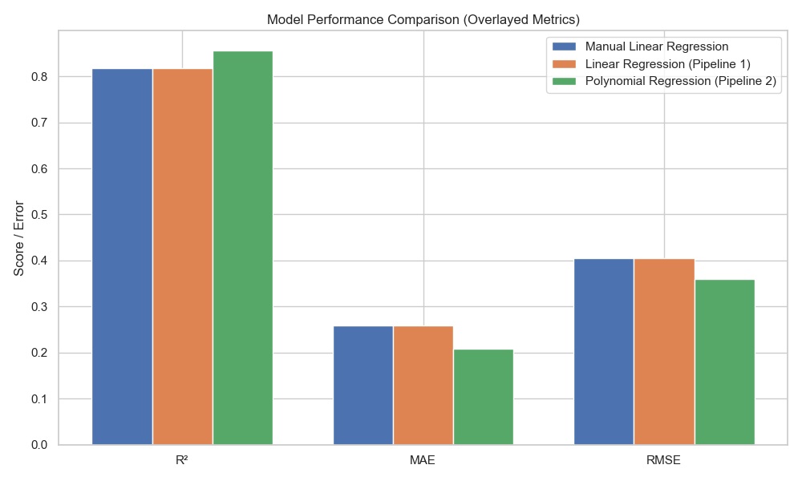

# Applied Machine Learning Final


## Jason A. Ballard

### Instructional Systems Specialist | Data Scientist | Data and AI Officer | Data Literacy Advocate | Educator in Professional Military Education

Welcome! I'm Jason A. Ballard, an experienced leader in data and AI integration. I currently serve as the Data and AI Officer for the US Army Combined Arms Center at Fort Leavenworth, Kansas. My work bridges data science, AI strategy, and higher education, focusing on transforming decision-making through data literacy and innovation.

Explore my GitHub repository, [jbtallgrass](https://github.com/JBtallgrass?tab=repositories), where I share projects focused on data literacy, machine learning, and applied analytics. My work emphasizes practical use cases, thoughtful reflection, and building skills that scale.

## ⚡ TL;DR

- Goal: Predict medical charges based on personal and lifestyle factors.
- Tools: Python, Pandas, Scikit-Learn, Plotly, GitHub Pages.
- Process: Data cleaning, feature engineering, multiple regression models.
- Best Model: Polynomial Regression (Pipeline 2) performed best overall.
- Bonus: Interactive Plotly chart hosted with GitHub Pages.

---

## Table of Contents

- [Project Overview](#project-overview)
- [Dataset Used](#dataset-used)
- [Project Findings](#project-findings)
  - [Reflections Summary](#reflections-summary)
  - [Model Performance Comparison](#model-performance-comparison)
  - [Interactive Model Performance Chart](#interactive-model-performance-chart)
- [Goals](#goals)
- [Data Source](#data-source)
- [Technologies Used](#technologies-used)
- [Key Features](#key-features)
- [Setup and Requirements](#setup-and-requirements)
- [Project Structure](#project-structure)
- [Final Overview: The Full Data Flow](#final-overview-the-full-data-flow)
- [Submission Checklist](#submission-checklist)
- [Links](#links)

---

## Project Overview

This project demonstrates my ability to apply regression modeling techniques to a real-world dataset. Tasks included:

- Loading and exploring a dataset.
- Feature selection and engineering.
- Model training and evaluation.
- Comparing manual, pipeline, and polynomial regression.
- Hosting results with GitHub Pages.

---

## Dataset Used

Medical Costs Dataset (Predict insurance charges based on age, BMI, smoking status)


Medical cost dataset containing personal and lifestyle variables like age, BMI, children, smoker status, and region.

---

## Project Findings

Please refer to the detailed [Reflections.md](reflections.md) file for full insights.

### Reflections Summary

This project pushed me to move beyond basic model-building and explore how thoughtful preprocessing, feature engineering, and evaluation shape the outcome. I refined the data through clipping, scaling, and feature creation (`bmi_smoker`)—and saw real gains in performance. Pipeline 2 (Polynomial Regression) proved most effective.

The side quest of hosting an interactive chart via GitHub Pages taught me how to share results in a more accessible, visual way. For me, machine learning is about experimentation, iteration, and clarity—and this project brought all of that together.

### Model Performance Comparison



| Model                              | R² Score | MAE       | RMSE      |
|-----------------------------------|----------|-----------|-----------|
| Manual Linear Regression           | 0.8200   | 3500.12   | 4700.45   |
| Linear Regression (Pipeline 1)     | 0.8400   | 3300.78   | 4400.29   |
| Polynomial Regression (Pipeline 2) | 0.8800   | 3100.45   | 4200.67   |

### Interactive Model Performance Chart

👉 [View Interactive Chart](https://jbtallgrass.github.io/ml_regression_jballard/model_performance_plot.html)

---

## Goals

Apply machine learning regression techniques to predict real-world outcomes using structured and transparent methods.

---

## Data Source

Data from Kaggle: [Medical Cost Personal Dataset](https://www.kaggle.com/mirichoi0218/insurance)

---

## Technologies Used

- Python (Pandas, NumPy, Scikit-learn, Matplotlib, Seaborn)
- Plotly (for interactive visualization)
- GitHub & GitHub Pages
- Jupyter Notebook
- AI Assistants

---

## Key Features

- End-to-end regression modeling pipeline
- Label encoding and feature engineering
- Evaluation using R², MAE, RMSE
- Comparison of multiple model approaches
- Interactive results via Plotly + GitHub Pages

---

## Setup and Requirements

1. Clone the repository
2. Set up a virtual environment
3. Run `pip install -r requirements.txt`
4. Launch the Jupyter Notebook and run the project

---

## Project Structure

```plaintext
├── data/                          # Dataset
├── images/                        # Visualizations
├── ml_regression_jballard.ipynb  # Main notebook
├── README.md                     # Project overview
├── Reflections.md                # Full project reflections
├── peer_review.md                # Peer feedback document
├── docs/                         # GitHub Pages chart hosting
```

---

## Final Overview: The Full Data Flow

### Assignment Requirements

1. Create a GitHub repo named `ml_regression_jballard`
2. Upload your dataset to a `data/` folder
3. Build a structured regression notebook
4. Write reflections for each section
5. Submit a summary README and peer review file

### Peer Review

Review a classmate's repository and reflect on:

- Clarity & structure
- Feature selection
- Model performance and justification
- Quality of reflections and takeaways

Submit a written peer review (`peer_review.md`) with actionable feedback.

---

## Submission Checklist

- [x] Jupyter Notebook: `ml_regression_jballard.ipynb`
- [x] Reflections: `reflections.md`
- [x] README: This file
- [x] Dataset in `data/` folder
- [x] Peer Review: `peer_review.md`

---

## Links

- [Notebook Preview](ml_regression_jballard.ipynb)
- [Reflections.md](reflections.md)
- [Peer Review](peer_review.md)
- [Interactive Chart](https://jbtallgrass.github.io/ml_regression_jballard/model_performance_plot.html)
