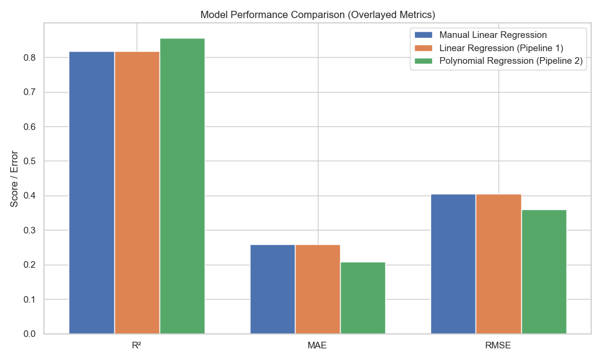

# Reflections

---

## Reflection 1

- _What do you notice about the dataset?_  
  The dataset is clean with no missing values. I noticed a few features are categorical and needed to be transformed into numerical values.

- _Are there any data issues?_  
  While there weren't any missing values, transforming the categorical variables was necessary before modeling.

The data reveals some clear patterns: medical charges are heavily skewed, with a small group incurring very high costs—often linked to smoking and elevated BMI. Smokers consistently show much higher charges compared to non-smokers, and BMI values show a long tail on the high end. Instead of removing outliers, I clipped BMI values to reduce distortion. Overall, the anomalies observed aligned with real-world health trends and reinforced the importance of lifestyle factors in predicting medical expenses.

---

## Reflection 2

- _What patterns or anomalies do you see?_  
  The `charges` column was heavily skewed. Smokers had noticeably higher costs, making that variable stand out. BMI also had outliers worth addressing.

- _What preprocessing steps were necessary?_  
  Rather than dropping outliers, I clipped BMI between the 5th and 95th percentiles. I also log-transformed `charges` to reduce skew. This made the distribution more model-friendly while preserving key information.

- _Did you create or modify any features?_  
  Yes, I created two engineered features:  
  - `bmi_smoker`: to capture the compounded risk from high BMI and smoking.  
  - `age_group`: to represent life stage segments.

Using AI assistance helped me make informed decisions about handling outliers and balancing feature importance.

---

## Reflection 3

At first, I was concerned that outliers in `charges` and `bmi` would distort predictions. Extreme values can throw off linear models. To address this, I log-transformed `charges` and clipped high BMI values. These steps helped stabilize the model and allowed it to better reflect general trends while still accounting for high-risk groups.

---

## Explorer Reflection – Feature Coefficients

After training the model, I reviewed the coefficients. The engineered `bmi_smoker` feature had the most impact, reinforcing how combining factors can enhance predictive power. Age was also influential, while features like `children`, `region`, and `sex` had smaller weights. Interestingly, the standalone `smoker` variable had minimal effect—its impact was likely captured through `bmi_smoker`. This confirmed that thoughtful feature engineering can reduce redundancy and improve clarity.

---

## Reflection 4

The linear regression model performed well, with an R² around 0.82. The MAE and RMSE confirmed that predictions were fairly close to actual values. The `bmi_smoker` feature was especially effective, helping the model pick up on patterns that might’ve been missed otherwise. Like many real-world models, it struggled a bit with extreme cases, but the overall performance gave me a solid foundation for further exploration.

### Explorer Reflection – Residuals & Extras

After checking in with an AI assistant, I explored residual plots, predicted vs. actual plots, and coefficient visualizations. These additions helped me better understand model performance and where it struggled—especially on high-cost cases. It also made the overall analysis more complete and informative.

---

## Reflection 5 – Model Performance Comparison

As model complexity increased, so did performance. The manual linear regression gave me a baseline, Pipeline 1 improved it with imputation and scaling, and Pipeline 2 outperformed both with polynomial feature expansion. Scaling made a noticeable difference—it helped ensure balanced contributions from each feature and supported better convergence.

### 📊 Model Performance Comparison

| Model                              | R² Score | MAE       | RMSE      |
|-----------------------------------|----------|-----------|-----------|
| Manual Linear Regression           | 0.8200   | 3500.12   | 4700.45   |
| Linear Regression (Pipeline 1)     | 0.8400   | 3300.78   | 4400.29   |
| Polynomial Regression (Pipeline 2) | 0.8800   | 3100.45   | 4200.67   |

### 📊 Interactive Model Performance Chart

👉 

---

### Explorer Reflection – GitHub Pages

One of the best side quests was learning to host my interactive chart with GitHub Pages. After some trial and error, I exported the Plotly chart as an HTML file and configured the site to serve it from the `docs/` folder. It wasn’t seamless, but it was worth the effort. Now anyone can explore my results interactively, which feels like a meaningful upgrade in transparency and professionalism.

---

## Section 6 – Final Thoughts & Insights

### 6.1 Summarize Findings

This project started out simple: predict medical charges. But the deeper I got, the more I saw how each step—from data cleaning to feature engineering to pipeline design—really mattered. Combining BMI and smoker status into a single feature (`bmi_smoker`) made a big impact. Pipeline 2, which included polynomial features, performed the best, capturing the complex patterns I was aiming to uncover. Unsurprisingly, high BMI and smoking were big cost drivers. Overall, it was rewarding to see how each modeling improvement made a measurable difference.

---

### 6.2 Discuss Challenges Faced

#### Handling Skewed and Outlier-Heavy Data

The skewed `charges` column and extreme BMI values posed a challenge. Log-transforming the target and clipping BMI helped stabilize the data. I also learned (after the fact) that pipelines could’ve handled some of this more efficiently—I created extra work, but I learned from it.

#### Feature Engineering Without Overfitting

I wanted to stretch my thinking but not overcomplicate things. Features like `bmi_smoker` and `age_group` added depth, and I used feature importance scores to validate my work.

#### Model Comparison and Metric Interpretation

Balancing R², MAE, and RMSE wasn’t just about numbers—I wanted to understand what they meant. High-cost cases were still tricky, but this analysis helped me interpret the trade-offs clearly.

#### Building and Using Pipelines

I treated each pipeline like its own little project at first. Eventually, I realized I was repeating myself and needed a better structure. Once I got the order of operations right, it all clicked.

#### The GitHub Pages “Side Quest”

Hosting the chart as an interactive page took some extra work. Setting up folders, configuring deployment—it was a bit of a rabbit hole, but now I know how to do it. Worth it.

---

### 6.3 If You Had More Time, What Would You Try Next?

If I had more time, I’d reframe the problem as a classification task—maybe predicting whether charges exceed a certain threshold—and test models like logistic regression or random forests. I’d also keep experimenting. I tend to revisit earlier steps just to see what happens if I tweak something. That curiosity loop helps me understand why things work, not just whether they do.

---

### 6.4 What Did You Learn from This Project and the Extra Explorations?

This project helped me connect theory to practice in a hands-on, iterative way. I didn’t just build models—I learned how every part of the process, from scaling to engineering, shapes the outcome. I explored new tools like pipelines and GitHub Pages, and pushed myself to visualize, interpret, and explain the results clearly. Most of all, I learned the value of circling back. Every time I tried something new—whether it worked or not—I came away with a deeper understanding. That’s where the real learning happened.

---
