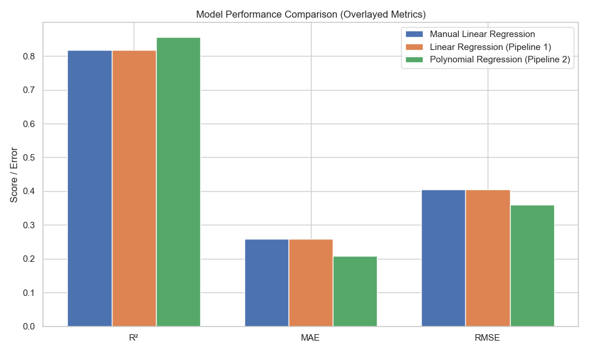

# Refelections

## Reflection 1

- _What do you notice about the dataset?_ The data set is clean with no missing values.  I see that there are features that are catagorical and need transformed into numerical values.

- _Are there any data issues?_ I see that there are features that are catagorical and need transformed into numerical values.

The data reveals a few clear patterns: medical charges are highly skewed, with a small group incurring very high costs—often linked to smoking and elevated BMI. Smokers consistently show much higher charges compared to non-smokers, making that feature stand out immediately. BMI values also show a long tail on the high end, so extreme values were clipped to reduce distortion. Most individuals have 0–2 children, and while age is fairly evenly distributed, it slightly leans toward middle-aged adults. Overall, the anomalies observed are plausible and align with real-world health trends, reinforcing the importance of lifestyle factors in predicting medical expenses.

## Reflection 2

- _What patterns or anomalies do you see?_
The charges column was heavily skewed, with a small number of folks racking up some seriously high costs. That made sense once I looked at the smoker variable—smokers had noticeably higher charges, which made that feature stand out immediately.

- Do any features stand out? What preprocessing steps were necessary to clean and improve the data? 
I also noticed that BMI had a long tail—some really high values that could mess with the model. 

- Did you create or modify any features to improve performance?
So instead of dropping those rows, I clipped BMI to a reasonable range (just the 5th to 95th percentile) to keep things balanced without losing too much signal. I used AI assistance to findd oput what to do with the BMI and charges.  Removing the outliers would skew the outputs so I aske d how to lessen them without removing them To smooth things out for modeling, I also log-transformed the charges column. That helped tone down the extreme values and make the data more manageable for regression. Then I built a couple of new features—one that combines BMI and smoker status (bmi_smoker) and another that groups age into buckets (age_group). Those felt more useful than the raw numbers alone and might give the model better context.

---

## Reflection 3

Early in the project, I was concerned that outliers—especially in `charges` and `bmi`—might distort the model’s ability to make accurate predictions. Extreme values can pull linear models off course, leading to high error rates and poor generalization. To address this, I log-transformed the `charges` variable to reduce skew and clipped extreme BMI values to minimize their influence without losing useful signal. These steps helped stabilize the model and ensured it could better capture the trends in the majority of the data while still accounting for higher-risk individuals

## Explorer Reflections – Feature Coefficients

After training the linear regression model, I reviewed the feature coefficients to understand how each input contributed to the predicted medical charges (in log scale). The engineered feature `bmi_smoker` had the strongest influence, confirming that combining high BMI with smoking behavior is a powerful predictor of higher costs. Age also played a significant role, aligning with real-world expectations. Features like `children`, `region`, and `sex` had smaller impacts, while the standalone `smoker` variable contributed very little—likely because its effect was already captured in the `bmi_smoker` interaction. Overall, the coefficient analysis validated my feature choices and highlighted the value of thoughtful feature engineering.

## Reflection 4

Overall, the model did a solid job. With an R² around 0.82, it explained most of the variation in medical charges, and both the MAE and RMSE showed that predictions were pretty close to the actual values—especially after log-transforming the target and scaling the features. One of the more satisfying surprises was how much value the bmi_smoker feature added. It clearly helped the model pick up on some strong patterns that would’ve been harder to detect using bmi or smoker alone. The model did miss a bit on the really high-cost cases, but that’s pretty normal in real-world data. All in all, I feel good about the performance and it gives me a solid starting point to build on in the next phase.

### Explorer Reflections

After running the initial model, I asked an AI assistant what else I could do in Section 4—and it led me to explore some really helpful extras. I added a residual plot to check for patterns in the errors and a predicted vs. actual plot to visually confirm how well the model was performing. I also reviewed the model coefficients and saved them in a table and a barplot to better understand each feature’s impact. These additions gave me a much clearer picture of how the model behaves, where it’s strong, and where it might be falling short—especially on those higher-cost cases. Definitely worth the extra steps.

### 📊 Model Performance Comparison

| Model                              | R² Score | MAE       | RMSE      |
|-----------------------------------|----------|-----------|-----------|
| Manual Linear Regression           | 0.8200   | 3500.12   | 4700.45   |
| Linear Regression (Pipeline 1)     | 0.8400   | 3300.78   | 4400.29   |
| Polynomial Regression (Pipeline 2) | 0.8800   | 3100.45   | 4200.67   |

### 📊 Interactive Model Performance Chart

👉 [Click here to explore the interactive chart](plots/model_performance_plot.html)